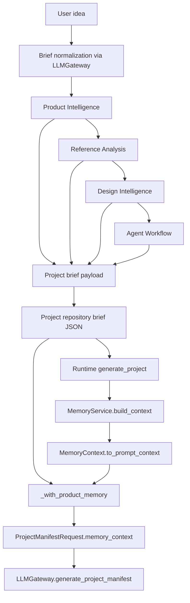
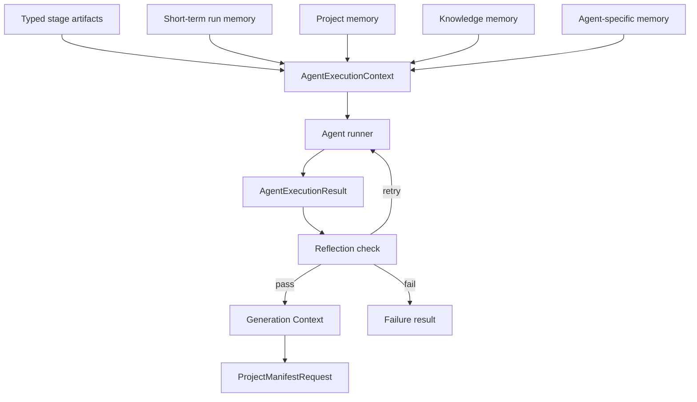
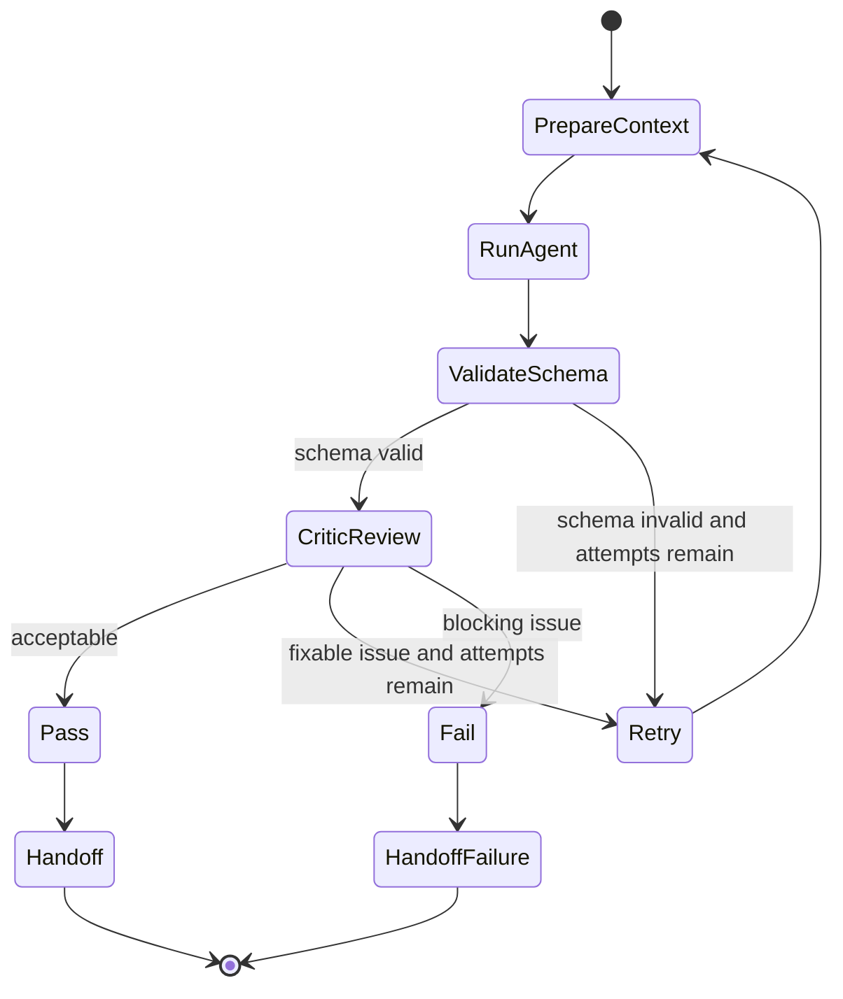
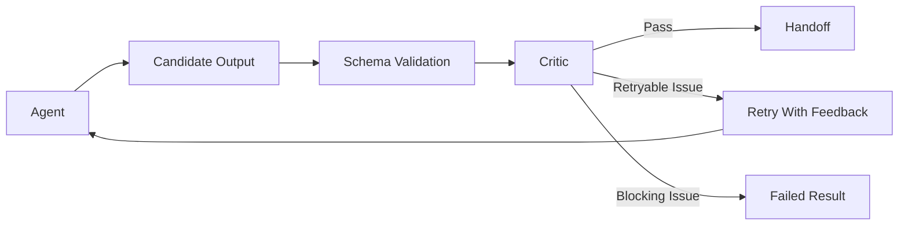
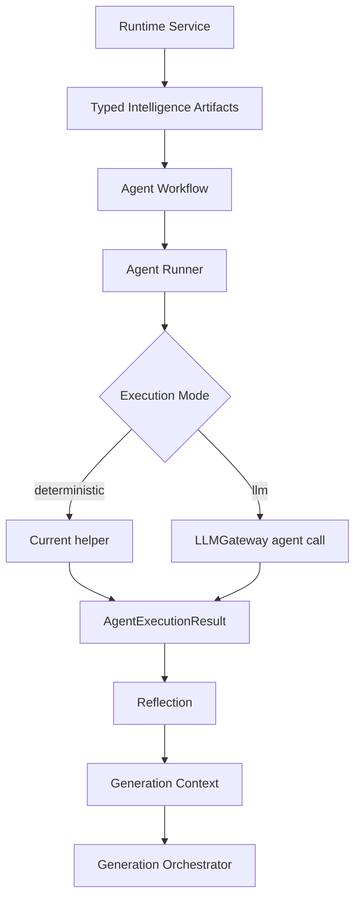

# Future Agent Execution Architecture

## Scope

This document prepares Vuls for future LLM-backed agent execution without changing current external behavior.

It is design-only. It does not implement provider calls, memory storage, retry loops, new API routes, Supabase changes, GitHub export changes, new dependencies, LangGraph, CrewAI, or OpenHands.

The current code is the source of truth. Existing typed domain models should be extended or reused, not duplicated.

## Current State

The active pipeline is deterministic:

```text
Product Intelligence
-> Reference Image Intelligence
-> Reference Analysis
-> Design Intelligence
-> Agent Workflow
-> Agent Execution
-> Generation Context
```

In code, the runtime services currently create Product Intelligence, Reference Analysis, Design Intelligence, and Agent Workflow during intake. Agent Execution exists as deterministic helper functions in `src/vuls/agent_intelligence.py`, but the project and Telegram runtime services do not currently execute those helpers during generation context assembly.

## AGENT EXECUTION AUDIT REPORT

### Files Audited

- `src/vuls/agent_intelligence.py`
- `src/vuls/runtime/project_service.py`
- `src/vuls/runtime/telegram_service.py`
- Related tests in `tests/unit/test_agent_intelligence.py`, `tests/unit/runtime/test_project_service.py`, and `tests/unit/runtime/test_telegram_service.py`

### 1. How Agent Workflow Is Created

Agent Workflow is created by `plan_agent_workflow(task, registry=None)` in `src/vuls/agent_intelligence.py`.

The default registry contains four current roles:

- `vuls_architect`
- `product_manager`
- `ux_designer`
- `ui_designer`

The default workflow is fixed and deterministic:

```text
Vuls Architect -> Product Manager -> UX Designer -> UI Designer
```

Each workflow step includes:

- order
- agent role
- agent name
- task
- expected output
- handoff target

Both runtime services create workflow during project intake through `_project_brief_payload(...)`:

- `RuntimeProjectService.create_project(...)`
- `RuntimeTelegramFlowService.start_new_project(...)`

They store `agent_workflow` in the project brief payload as `agent_workflow.model_dump(mode="json")`.

On reload, `_agent_workflow_from_project(...)` validates existing stored mappings back into `AgentWorkflow` with `AgentWorkflow.model_validate(...)`. If no stored workflow exists, it rebuilds the default workflow from the raw idea, detected domain, and platform.

### 2. How Agent Execution Is Executed

Agent Execution is implemented by `execute_agent_workflow(workflow, context, registry=None)`.

The current execution path is deterministic:

- validates the step role exists in `AgentRegistry`
- dispatches by `AgentRole`
- returns one `AgentExecutionResult` per step

Current executors:

- `_execute_vuls_architect(...)`
- `_execute_product_manager(...)`
- `_execute_ux_designer(...)`
- `_execute_ui_designer(...)`

Current `AgentExecutionContext` contains:

- `user_prompt`
- `product_intelligence`
- `reference_analysis`
- `design_contract`
- optional `reference_image_analysis`

Current `AgentExecutionResult` contains:

- `step_order`
- `agent_role`
- `agent_name`
- `status`, currently only `"completed"`
- `summary`
- `outputs: dict[str, Any]`
- `handoff_to`

The tests exercise `execute_agent_workflow(...)` directly and assert deterministic outputs. Runtime generation does not call `execute_agent_workflow(...)` today.

### 3. What Information Is Passed Between Stages

The runtime intake payload includes:

- `raw_idea`
- `normalized_brief`
- `selected_template_key`
- `template_confidence`
- `product_brief`
- `feature_prioritization`
- `roadmap`
- `product_memory`
- `reference_image_analysis`, only when explicitly provided to `_project_brief_payload(...)`
- `reference_analysis`
- `design_contract`
- `agent_workflow`

Generation context is assembled by `_with_product_memory(project, memory_context)` in both runtime services.

The context passed into the generation orchestrator is `dict[str, list[str]]`, sourced from `MemoryContext.to_prompt_context()` and augmented under the `"project"` key with prompt strings from:

- `product_intelligence_prompt_items(...)`
- `reference_image_analysis_prompt_items(...)`, when present
- `reference_analysis_prompt_items(...)`
- `design_contract_prompt_items(...)`
- `AgentWorkflow.prompt_items()`

The project generation orchestrator then passes that flattened memory context to `ProjectManifestRequest`.

### 4. What Information Is Lost

Current runtime loses or excludes several future-agent-relevant details:

- Agent Execution results are not run or included in generation context.
- Agent Execution warnings, errors, retries, provider metadata, and usage do not exist.
- Agent role documents are referenced in `Agent.memory`, but their contents are not loaded into runtime prompts.
- Structured Pydantic outputs are flattened into prompt strings before project generation.
- The generation prompt receives memory as `dict[str, list[str]]`, not as typed stage artifacts.
- Handoffs do not preserve per-agent input context, output schema name, validation status, or critic feedback.
- `GenerateProjectRequest.answers` is accepted by API shape but current generation context assembly does not use it.
- Reference image intelligence is included only if a `reference_image_analysis` payload exists; uploaded image ingestion is not wired in the audited runtime entry points.
- LLM usage and active model metadata are tracked for brief normalization and manifest generation, but not for agent execution.

### 5. What Future LLM Agents Would Require

Future LLM-backed execution needs:

- a stable agent execution request model
- a richer but backward-compatible execution result model
- explicit output schemas per agent role
- agent prompt builders that use existing typed stage models
- provider/model/usage metadata
- warning and error channels separate from successful structured outputs
- deterministic status transitions
- a boundary for reflection and retries
- short-term memory for current-run handoffs
- project memory for durable decisions
- knowledge memory for reusable rules and patterns
- agent-specific memory scoped by role and project
- context assembly that can include structured agent execution results without breaking existing generation behavior

## Phase 2 - Execution Output Design

### Design Principle

Prefer extension over replacement.

The existing `AgentExecutionResult` should remain the compatibility anchor. Current fields should keep their names and meanings. Future work can add optional fields and broaden `status` only after tests pin backward compatibility.

### Future-Safe Result Shape

Recommended additive model shape:

```python
class AgentExecutionWarning(BaseModel):
    code: str
    message: str
    details: dict[str, Any] = Field(default_factory=dict)


class AgentExecutionError(BaseModel):
    code: str
    message: str
    retryable: bool = False
    details: dict[str, Any] = Field(default_factory=dict)


class AgentExecutionMetadata(BaseModel):
    execution_mode: Literal["deterministic", "llm"] = "deterministic"
    provider: str | None = None
    model: str | None = None
    usage: LLMUsage | None = None
    attempt: int = 1
    max_attempts: int = 1
    duration_ms: int | None = None
    schema_name: str | None = None
    raw_response_id: str | None = None


class AgentExecutionResult(BaseModel):
    step_order: int
    agent_role: AgentRole
    agent_name: str
    status: Literal["completed", "failed", "skipped"] = "completed"
    summary: str
    outputs: dict[str, Any] = Field(default_factory=dict)
    warnings: list[AgentExecutionWarning] = Field(default_factory=list)
    errors: list[AgentExecutionError] = Field(default_factory=list)
    metadata: AgentExecutionMetadata = Field(default_factory=AgentExecutionMetadata)
    handoff_to: AgentRole | None = None
```

This keeps existing required fields intact and adds future channels for provider-backed execution.

### Compatibility Notes

- Existing deterministic helpers can keep returning `status="completed"` with `outputs`.
- `warnings`, `errors`, and `metadata` should default to empty or deterministic values.
- Existing tests that assert current fields should continue to pass after additive changes if defaults are used.
- `outputs` remains a compatibility field, but future role outputs should be validated before entering it.
- Do not duplicate Product Intelligence, Reference Analysis, or Design Contract models. Agent outputs should reuse those models or define only missing role-specific models.

### Future Output Schemas By Role

Recommended role-specific structured outputs:

| Agent role | Future structured output | Source of truth |
| --- | --- | --- |
| Vuls Architect | architecture decisions, pipeline constraints, risk notes | New role-specific model |
| Product Manager | product decisions and open questions | Existing Product Intelligence models where possible |
| UX Designer | journeys, screen inventory, navigation, states | New UX output model, because no dedicated UX model exists today |
| UI Designer | design refinements and handoff notes | Existing Design Contract where possible |
| Frontend Engineer | implementation plan, files changed, validation evidence | Future implementation result model |
| Backend Engineer | service boundaries, contracts, risks | Future backend result model |
| QA Engineer | validation scope, findings, evidence, recommendation | Future QA result model |

## GENERATION CONTEXT REPORT

### Current Generation Context Flow



### Outputs Currently Included

Generation context currently includes:

- user memory summaries
- project memory summaries
- conversation memory summaries
- knowledge memory summaries
- Product Intelligence prompt strings
- Reference Image Intelligence prompt strings when present
- Reference Analysis prompt strings
- Design Intelligence prompt strings
- Agent Workflow prompt strings

### Outputs Currently Excluded

Generation context currently excludes:

- Agent Execution results
- raw structured model JSON for upstream intelligence artifacts
- per-agent warnings and errors
- provider/model/usage metadata
- reflection results
- retry history
- role document contents from `docs/agents/*.md`
- generated project validation results
- user answer payloads from `GenerateProjectRequest.answers`

### Future Agent Context Needs

Future agents should be able to consume:

- current typed stage artifacts, not only flattened prompt strings
- prior agent results from the same run
- durable project decisions
- role instructions
- anti-copy constraints
- model/provider metadata for traceability
- warnings, errors, and unresolved questions
- reflection feedback and retry decisions

### Target Context Flow



### Compatibility Path For Context Assembly

The safest migration path is additive:

1. Keep current `_with_product_memory(...)` output unchanged.
2. Add agent execution prompt items only when execution results exist.
3. Keep the prompt item format stable for generation.
4. Later, add a typed internal context object before flattening to `dict[str, list[str]]`.
5. Keep `ProjectManifestRequest.memory_context` unchanged until external behavior is intentionally updated.

## AGENT MEMORY DESIGN DOCUMENT

### Memory Goals

Agent memory should support better context without changing current storage behavior until explicitly implemented.

The design separates memory by lifetime and ownership:

- short-term memory: current execution run
- project memory: project lifetime
- knowledge memory: reusable knowledge
- agent memory: role-specific learned or selected context

### Short-Term Memory

Short-term memory lives only during one execution run.

It should include:

- active `AgentWorkflow`
- current `AgentExecutionContext`
- completed `AgentExecutionResult` objects
- handoff notes
- reflection feedback
- retry counters
- transient warnings and non-durable errors

Recommended location when implemented:

- in-memory execution runner object
- passed explicitly between agent steps
- not written to Supabase by default

### Project Memory

Project memory lives for the project lifetime.

Current implementation already stores:

- project goal
- extracted requirements
- project facts

Future project memory should add durable summaries of:

- product decisions
- UX decisions
- design decisions
- accepted architecture constraints
- unresolved project risks
- user-approved changes

Compatibility note: no Supabase change is required for an initial design because existing memory rows already support `content`, `summary`, and `memory_type=project`.

### Knowledge Memory

Knowledge memory is reusable across projects for a profile or project context.

Current implementation already supports `MemoryType.KNOWLEDGE`.

Future knowledge memory may include:

- reusable generation rules
- provider-specific limitations
- template quality lessons
- validation heuristics
- anti-copy and design constraints

Knowledge memory must not silently override project-specific context.

### Agent Memory

Agent memory is role-specific context.

Initial implementation should avoid a database schema change by storing agent memory as structured content in existing memory rows:

```json
{
  "category": "agent_memory",
  "agent_role": "ux_designer",
  "scope": "project",
  "decision": "Use a mobile-first bottom navigation model.",
  "source_execution_id": "optional-run-id"
}
```

Later, if agent memory becomes high-volume or query-heavy, a dedicated storage model can be proposed with explicit approval.

### Memory Resolution Order

Recommended read order for future agent execution:

1. Role instructions
2. Current run short-term memory
3. Typed stage artifacts
4. Project memory
5. Conversation memory
6. User memory
7. Knowledge memory
8. Agent-specific memory

Project-specific facts should outrank reusable knowledge. Current-run handoffs should outrank older project memory.

## LLM GATEWAY READINESS REPORT

### Files Audited

- `src/vuls/llm/gateway.py`
- `src/vuls/llm/openai_client.py`
- `src/vuls/llm/schemas.py`
- `src/vuls/llm/prompts.py`
- `src/vuls/llm/safety.py`
- `src/vuls/runtime/container.py`
- LLM unit tests

### What Exists Today

The LLM gateway already provides:

- `LLMClient` protocol with `complete_json(...)`
- `LLMGateway` with fallback model sequencing
- structured error classes
- usage metadata via `LLMUsage`
- provider failure payloads
- JSON parsing and repair
- Pydantic validation
- safety checks
- configurable `openai_base_url`
- a concrete `OpenAIResponsesClient`

Current gateway methods are specific:

- `normalize_brief(...)`
- `generate_project_manifest(...)`

### Can Agent Execution Consume LLM Providers Today?

Not directly.

Agent Execution could use the same lower-level concepts, but there is no public agent execution method, no agent prompt builder, no agent output schema registry, no agent request model, and no runtime runner that injects `LLMGateway` into `execute_agent_workflow(...)`.

The current `LLMGateway._complete_with_fallback(...)` is private and generic enough internally, but future agent execution should not depend on private methods.

### Required Integration Points

Future work should add:

- `AgentExecutionRequest`
- `AgentExecutionResponse`
- agent prompt builders
- agent output schema registry
- public structured generation method on `LLMGateway`, or a narrow `generate_agent_output(...)`
- agent runner that chooses deterministic or LLM execution mode
- result mapping from `LLMUsage`, active model, provider failures, and validation errors into `AgentExecutionMetadata`, `warnings`, and `errors`
- tests with fake `LLMClient`

### Provider Compatibility

OpenRouter:

- The existing base URL and model fallback configuration are compatible in shape.
- Actual compatibility depends on whether the provider endpoint supports the current Responses API and strict JSON schema format used by `OpenAIResponsesClient`.

Ollama:

- Future support likely requires a new `LLMClient` implementation if the local endpoint uses chat completions rather than the Responses API.
- No new dependency is required if implemented through `httpx`.

Claude:

- Direct Anthropic integration requires a new `LLMClient` implementation or access through an OpenAI-compatible gateway.
- No agent architecture should assume Claude-specific message or tool formats.

OpenAI:

- Current client is already OpenAI-oriented through the Responses API.
- Agent execution can reuse structured outputs once agent-specific schema and prompt builders exist.

## REFLECTION LOOP DESIGN

### Goal

The reflection loop should validate an agent result before handoff, retry when useful, and fail loudly when the result cannot meet schema or quality requirements.

No retry behavior is implemented by this document.

### State Transitions



### Critic Inputs

A critic should receive:

- original agent task
- role instructions
- typed stage artifacts
- candidate `AgentExecutionResult`
- expected output schema
- anti-copy constraints
- previous warnings and retry notes

### Pass Criteria

A result can pass when:

- schema validation succeeds
- required output fields are present
- role boundaries are respected
- anti-copy constraints are preserved
- no blocking errors exist
- warnings are non-blocking and explicit

### Retry Strategy

Recommended defaults:

- `max_attempts=2` for agent execution
- `max_attempts=1` for deterministic mode
- retry only for schema validation failures, incomplete required outputs, or critic findings marked retryable
- do not retry policy/safety failures
- include critic feedback in the next attempt as short-term memory

### Failure Handling

On failure:

- return an `AgentExecutionResult` with `status="failed"`
- include structured `errors`
- preserve provider/model/attempt metadata
- do not silently continue as if the agent completed
- decide at orchestration boundary whether generation may continue with deterministic fallback

### Reflection Flow



## Target State

The target architecture keeps deterministic behavior available while enabling LLM-backed agents behind explicit boundaries.



The runner should be the only place that knows whether a step is deterministic or LLM-backed. Runtime services should only ask for execution and receive typed results.

## Migration Path

### Step 1 - Extend Execution Result Compatibility

Add optional `warnings`, `errors`, and `metadata` fields to `AgentExecutionResult`.

Keep current deterministic executors and tests passing.

### Step 2 - Add Prompt and Schema Contracts

Create agent-specific request and response models only where no model already exists.

Do not duplicate Product Intelligence, Reference Analysis, or Design Contract models.

### Step 3 - Add Agent Runner Interface

Introduce an internal runner boundary:

```python
class AgentExecutor(Protocol):
    def execute(
        self,
        workflow: AgentWorkflow,
        context: AgentExecutionContext,
    ) -> list[AgentExecutionResult]: ...
```

The first implementation can delegate to current deterministic helpers.

### Step 4 - Add LLM Gateway Agent Method

Add a public gateway method for structured agent outputs.

It should reuse:

- `LLMClient.complete_json(...)`
- fallback handling
- usage metadata
- Pydantic validation
- safety checks

### Step 5 - Wire Execution Results Into Generation Context

Only after execution results exist at runtime, append their `prompt_items()` to generation context after Agent Workflow.

Keep existing context order:

```text
Product Intelligence
-> Reference Image Intelligence
-> Reference Analysis
-> Design Intelligence
-> Agent Workflow
-> Agent Execution
```

### Step 6 - Add Reflection As An Internal Boundary

Add reflection after LLM-backed agent calls, before handoff.

Do not expose reflection through API routes initially.

### Step 7 - Add Durable Memory Writes Later

Only after result shape and execution behavior are stable, propose durable memory writes.

Initial durable memory can use existing `memory_items` content payloads. Schema changes should be a separate approved task.

## Risks

- Flattening structured artifacts too early may hide important distinctions for agents.
- Adding execution results to generation context may alter generated manifests if enabled by default.
- Direct provider compatibility differs across OpenAI, OpenRouter, Ollama, and Claude.
- Critic loops can increase latency and cost.
- Persistent agent memory can pollute future runs if not scoped and ranked carefully.
- Extending `status` from only `"completed"` must be done with tests for existing consumers.
- Runtime services currently duplicate context assembly logic between project and Telegram flows.

## Compatibility Concerns

- Do not change API response models for this architecture work.
- Do not change Supabase schema for the first execution-readiness pass.
- Do not change GitHub export.
- Do not change generation manifest contracts.
- Do not remove or rename current `AgentExecutionResult` fields.
- Do not require LLM-backed execution for current generation.
- Keep deterministic execution available as fallback.
- Keep old project brief payloads loadable.

## Expected Implementation Order

1. Add tests for additive `AgentExecutionResult` fields.
2. Add optional warnings/errors/metadata models in `agent_intelligence.py`.
3. Add deterministic metadata defaults.
4. Add an internal agent executor interface.
5. Add tests proving runtime behavior is unchanged when execution is not wired.
6. Add agent result prompt item formatting.
7. Add optional runtime wiring behind an internal boundary.
8. Add public LLM gateway method for agent structured output.
9. Add provider-neutral fake-client tests.
10. Add reflection tests and deterministic retry state transitions.
11. Propose memory persistence as a separate task.

## Summary

Vuls is already close to agent-readiness because the major pipeline artifacts are typed Pydantic models and the LLM gateway already validates structured JSON. The main missing piece is not provider access. The missing piece is an execution boundary that can preserve typed context, produce richer execution results, and feed those results into generation context without changing current behavior by accident.

The safest path is to keep current deterministic execution intact, extend `AgentExecutionResult` additively, add an internal runner, then wire LLM-backed execution and reflection only after tests prove compatibility.
