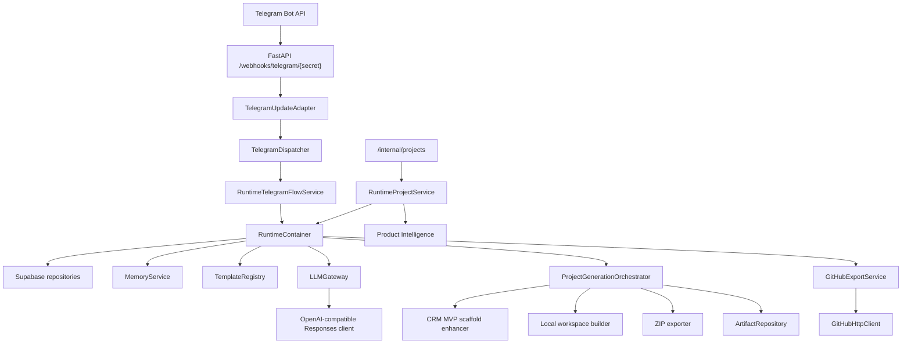
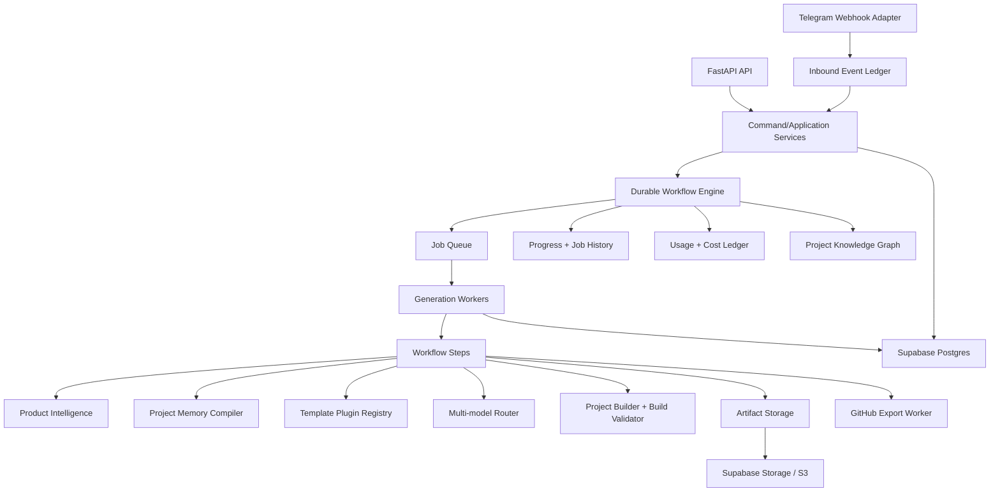
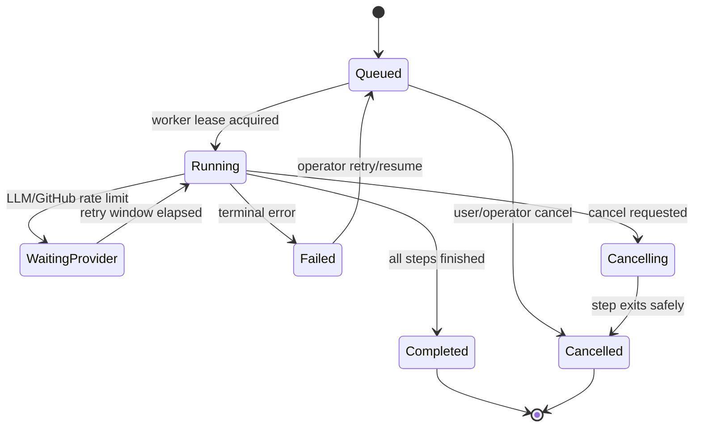

# Vuls V2 Architecture Report

Date: 2026-06-04

## Executive Summary

Vuls V1 is a Telegram-first AI Product Builder with a working MVP path:
Telegram input, project intake, memory, template selection, LLM manifest generation,
CRM scaffold hardening, ZIP export, GitHub export, Product Intelligence, and health
diagnostics.

The strongest V1 traits are clear protocol boundaries, deterministic tests, strong
manifest validation, structured LLM fallback, and conservative runtime wiring. The main
V2 gap is not code generation quality alone. It is durability. Today generation runs
inside synchronous request paths, project status is coarse, `generation_runs` exists in
SQL but is not activated in code, and generated artifacts are persisted best-effort.

V2 should become a durable product-generation platform:

- API and Telegram become thin adapters.
- A workflow engine owns project generation as persisted jobs.
- Each generation step records state, progress, retries, usage, cost, artifacts, and
  user-visible messages.
- Template generators become plugin-like units instead of one CRM special case.
- Product Intelligence and Memory become typed project knowledge, not only JSON in
  `projects.brief`.
- LLM routing becomes cost-aware and step-aware.
- GitHub and ZIP export become resumable workflow steps.

This report audits the current system, ranks the 20 biggest bottlenecks, designs Vuls V2
for 1,000, 10,000, and 100,000 projects, and defines the first implementation slice.

## Current System Map

### API

Responsibility:

- Build FastAPI app.
- Validate startup settings and runtime wiring.
- Expose health, Telegram webhook, internal project routes, product brief, roadmap, and
  memory routes.

Dependencies:

- `Settings`, `RuntimeContainer`, `RuntimeProjectService`, Telegram dispatcher/sender.

Failure points:

- Runtime construction failure at app startup.
- Webhook secret mismatch.
- Webhook path currently performs dispatch and send inside the request.
- Internal project generation can block while LLM, ZIP, and GitHub complete.

Technical debt:

- API docs are stale relative to Product Intelligence and health response shape.
- `/health` reports configured dependencies more than true live readiness.
- `UnconfiguredProjectService` still exists as fallback for tests/non-runtime app.

Scalability:

- Fine for local and low-volume MVP.
- Not sufficient for high concurrency because work is synchronous and not job-backed.

### Runtime

Responsibility:

- Compose repositories, services, LLM client, GitHub client, generator, Telegram flow,
  and internal project service.
- Implement project intake and generation flows.

Dependencies:

- Supabase client, OpenAI-compatible client, GitHub REST client, template registry,
  memory service, generation orchestrator.

Failure points:

- Duplicate logic between `RuntimeProjectService` and `RuntimeTelegramFlowService`.
- No idempotency key for Telegram updates, callbacks, or generation requests.
- `generation_run_id=None` is passed into generation.
- Telegram flow catches broad `Exception` and compresses all failures to
  `generation_failed`.

Technical debt:

- Application use cases are split between two runtime services.
- Workflow tables in Supabase are not actively used.
- No first-class progress state.

Scalability:

- Runtime composition is easy to test but all work is in-process.
- Horizontal scaling would duplicate webhook handling without idempotency protection.

### Generation

Responsibility:

- Ask LLM for project manifest.
- Enhance CRM manifests into a buildable Next.js App Router Supabase MVP.
- Write workspace, create ZIP, record artifacts.

Dependencies:

- LLM gateway, template registry, local filesystem, artifact repository.

Failure points:

- Local workspace can collide if project names repeat.
- `crm_mvp.py` is a 1,600-line generator embedded as a special case.
- Artifact persistence is best-effort, so project may complete without durable artifact
  metadata.
- No build validation inside the generation workflow itself.

Technical debt:

- CRM-specific generation is not a plugin.
- ZIP files are local disk artifacts instead of Supabase Storage/S3 objects.
- No generation step ledger.

Scalability:

- Works for small projects.
- At 10,000+ projects, local disk and synchronous ZIP/GitHub work become bottlenecks.

### Templates

Responsibility:

- Load five file-based templates: CRM, SaaS, Marketplace, AI Agent, Dashboard.
- Validate metadata.
- Select template with deterministic keyword scoring.
- Render LLM prompt context.

Dependencies:

- Local YAML/JSON-compatible files read through `json.loads`.

Failure points:

- Low semantic understanding for ambiguous ideas.
- Template definitions in DB exist but runtime uses local catalog only.
- CRM template still contains auto/car-wash keywords in metadata, although generated
  scaffold is domain-aware.

Technical debt:

- No versioned template runtime selection.
- No template-specific generator interface.
- No template cost/quality profile.

Scalability:

- File catalog is stable for MVP.
- V2 needs template versions, marketplace packs, and safe promotion/rollback.

### LLM

Responsibility:

- Normalize ideas to `ProjectBrief`.
- Generate project manifests.
- Enforce structured outputs.
- Repair malformed JSON.
- Fallback across configured models.
- Classify provider errors.

Dependencies:

- OpenAI Python SDK, OpenAI-compatible base URL, `httpx` with `trust_env=False`.

Failure points:

- Fallback is global, not per task or per cost/latency profile.
- No usage/cost persistence.
- No circuit breaker or provider health score.
- Safety filter is only a small deterministic list.

Technical debt:

- Prompt builder owns all LLM context shape.
- JSON repair is useful but should record repair events.
- No streaming or incremental generation support.

Scalability:

- Good first reliability layer.
- Needs job-step LLM routing, quotas, cache, and cost ledger for 10,000+ projects.

### Storage

Responsibility:

- Supabase client creation.
- Repositories for profiles, projects, memory, artifacts, templates, GitHub metadata,
  audit events.

Dependencies:

- Supabase Python client, PostgREST, `httpx` configured with no environment proxies.

Failure points:

- Transient retries exist only for memory and artifacts.
- Project status updates, audit, GitHub metadata, and templates are not retry-safe.
- RLS is enabled but no policies are defined in the migration.
- Storage bucket is configured but ZIP export currently writes local files.

Technical debt:

- Existing SQL includes `generation_runs`, `project_stages`, `conversation_messages`,
  `project_members`, and `telegram_chats`, but code does not use most of them.
- No data retention, archival, or cleanup strategy.

Scalability:

- Postgres tables are enough for V2 if indexed and job state is normalized.
- Large artifacts and logs must move to object storage.

### GitHub

Responsibility:

- Create personal or organization repositories.
- Sanitize repo names and descriptions.
- Retry name conflicts.
- Commit generated files.
- Persist repository metadata.

Dependencies:

- GitHub REST API through `urllib.request` opener with environment proxies disabled.

Failure points:

- Files are committed one by one.
- Mid-export failure leaves partial repository.
- No resume after partial export.
- No batching via Git trees/blobs.

Technical debt:

- Metadata persistence has no retry policy.
- GitHub export is not a workflow step.

Scalability:

- Fine for small generated apps.
- Large apps require tree commits, resumable export state, and rate-limit handling.

### Supabase

Responsibility:

- Database for profiles, projects, memory, templates, generation runs, artifacts,
  repositories, audit.

Dependencies:

- Hosted or local Supabase project.

Failure points:

- Schema may not be applied in user projects.
- RLS enabled with missing policies can block client-side access if anon/auth roles are
  later used.
- Service role key is server-only but centralizes broad privileges.

Technical debt:

- No migration for V2 workflow progress events.
- No storage upload code.
- No advisory health query.

Scalability:

- Good baseline for 1,000-10,000 projects.
- 100,000 projects need queue partitioning, index review, storage lifecycle, and
  background compaction.

### Product Intelligence

Responsibility:

- Build deterministic product brief.
- Prioritize features.
- Produce roadmap.
- Create product memory prompt items.

Dependencies:

- `ProjectBrief` and deterministic domain profiles.

Failure points:

- Domain detection is keyword-based.
- Product intelligence lives in `projects.brief` JSON, not normalized tables.
- No revision history beyond a static `change_history` list.

Technical debt:

- Should be split into planning, prioritization, roadmap, and memory compiler modules.
- Needs source attribution for decisions.

Scalability:

- Deterministic and cheap.
- Needs typed project knowledge graph for long-running projects.

### Telegram

Responsibility:

- Adapt webhook updates.
- Detect project intent.
- Dispatch commands and callbacks.
- Render localized replies and keyboards.
- Send Bot API messages.

Dependencies:

- aiogram Bot, i18n, runtime flow service.

Failure points:

- Long generation can still run during callback request.
- No duplicate update protection.
- No rate-limit aware sender queue.
- No progress message lifecycle.

Technical debt:

- Generated ZIP is returned as artifact id, not actual document sending.
- Conversation messages table is not used.

Scalability:

- Works for MVP.
- V2 needs inbound event ledger, outbound message queue, and progress notifications.

### Health

Responsibility:

- Report runtime readiness and LLM model diagnostics.

Dependencies:

- App state, settings, LLM gateway.

Failure points:

- Does not perform real Supabase query, GitHub token check, or LLM lightweight check.
- `supabase=ok` means runtime exists, not DB is reachable.

Technical debt:

- No `/ready`, `/live`, or detailed diagnostics endpoint.
- No Prometheus/Sentry integration despite `sentry_dsn` config.

Scalability:

- Needs layered health: liveness, readiness, provider diagnostics, queue lag, worker
  capacity.

### Config

Responsibility:

- Load `.env` settings.
- Store provider URLs, tokens, GitHub owner, workdir, rate limits.

Dependencies:

- Pydantic settings.

Failure points:

- Rate limits are configured but not enforced.
- No per-provider config array.
- No runtime feature flags.

Technical debt:

- LLM fallback models are CSV string.
- Secrets and public config share one settings object.

Scalability:

- V2 needs model/provider registry, budget limits, queue settings, worker concurrency,
  storage backend config, and environment-specific feature flags.

## Bottleneck Analysis

| Priority | Bottleneck | Impact | Probability | Fix Cost | Expected Effect |
|---:|---|---|---|---|---|
| 1 | Generation runs synchronously in API/Telegram paths | High: webhook timeout, poor UX, blocked workers | High | Medium | Durable, observable generation path |
| 2 | `generation_runs` table exists but is not used | High: no resume/history/cost ledger | High | Low | Foundation for V2 workflow |
| 3 | No idempotency for Telegram updates/callbacks/project generation | High: duplicate projects/repos | High | Medium | Safe retries and horizontal scaling |
| 4 | Runtime logic duplicated between internal API and Telegram service | Medium-high: drift and bugs | High | Medium | Single application use-case layer |
| 5 | CRM generator is a 1,600-line special case | Medium-high: slow template expansion | High | Medium | Plugin generators and maintainability |
| 6 | GitHub commits files one by one | Medium-high: slow export and partial repos | Medium | Medium | Faster and resumable exports |
| 7 | Artifacts are local disk ZIPs, storage bucket unused | High: non-portable, not horizontally scalable | High | Medium | Durable artifact delivery |
| 8 | Health checks are mostly configuration checks | Medium-high: weak ops diagnosis | High | Low | Faster incident triage |
| 9 | No queue, worker, or job lease model | High: no reliable background work | High | Medium-high | Scales past one process |
| 10 | LLM routing is fallback-only, not cost/step-aware | Medium-high: cost and reliability risk | High | Medium | Lower cost and better provider reliability |
| 11 | Memory retrieval is recent-N only | Medium: weak long-term project context | High | Medium | Better project continuation and planning |
| 12 | Product Intelligence stored only in `projects.brief` JSON | Medium: hard to query/version | High | Medium | Better analytics and evolution history |
| 13 | RLS policies missing from migration | High if client access expands | Medium | Medium | Safer Supabase deployment |
| 14 | Project status is coarse | Medium: poor progress UX | High | Low | Better Telegram and API status |
| 15 | No cancellation/resume semantics | Medium-high: stuck jobs and wasted spend | Medium | Medium | Operator control and cost control |
| 16 | No cost/usage persistence | Medium-high: cannot manage margin | High | Low-medium | Business model and provider optimization |
| 17 | No build validation in workflow | High: generated repos can fail silently | Medium | Medium | Higher generated product quality |
| 18 | Template DB repository unused by runtime | Medium: no versioning/promotion | Medium | Medium | Template evolution and rollback |
| 19 | Telegram sender lacks rate-limit queue | Medium: 429 risk under load | Medium | Medium | Stable multi-user Telegram ops |
| 20 | Docs drift from implementation | Medium: slows operations and handoff | High | Low | Safer smoke tests and onboarding |

## Vuls V2 Design

### Target Architecture

### Scale 1,000 Projects

Shape:

- One FastAPI API instance.
- One or two worker processes.
- Supabase Postgres and Supabase Storage.
- In-process or Supabase-backed queue is acceptable if job leasing is persisted.

Architecture priorities:

- Activate `generation_runs`.
- Add workflow step state.
- Add progress endpoint and Telegram progress messages.
- Store ZIP artifacts in object storage.
- Add model usage/cost rows.
- Add idempotency for Telegram update id and generation requests.

Operational posture:

- Manual operator dashboard can be logs plus DB views.
- Nightly cleanup for old local workspaces.
- Health checks include DB connectivity, queue lag, active model, GitHub configured.

### Scale 10,000 Projects

Shape:

- API service horizontally scalable.
- Dedicated worker pool.
- Queue backed by Redis, Supabase queue, or Postgres SKIP LOCKED.
- Artifact storage is mandatory.
- GitHub export worker separated from generation worker.

Architecture priorities:

- Durable job leases and retry backoff.
- Step-level retries and idempotency keys.
- Per-provider circuit breaker.
- Build validation sandbox.
- Template versions and promotion workflow.
- Cost budget guardrails per user/project.

Operational posture:

- Metrics: queue lag, job duration, failure rates, LLM spend, artifact size.
- Sentry or equivalent error tracking.
- Admin retry/cancel/resume operations.

### Scale 100,000 Projects

Shape:

- API, workflow, generator, GitHub exporter, artifact service, memory compiler as
  separately scalable components.
- Partitioned job queues by priority/template/export type.
- Project knowledge graph and memory compaction jobs.
- Multi-region object storage or CDN for artifacts.

Architecture priorities:

- Workflow orchestration with persistent event history.
- Cost optimizer and model router with provider scoring.
- Template marketplace and sandboxed custom templates.
- Dedicated observability stack.
- Database partitioning/archival for job logs and events.
- Strict tenant/project authorization.

Operational posture:

- SLOs for project generation time and success rate.
- Automated provider failover.
- Release train for template generators.
- Usage-based billing and spend controls.

## Durable Workflow Layer Design

### Goals

- Persist every generation run.
- Track progress per step.
- Retry safely.
- Resume after process restart.
- Cancel jobs.
- Preserve job history for support, analytics, and billing.

### Core Entities

Existing table to activate:

- `generation_runs`
  - `project_id`
  - `status`
  - `provider`
  - `model`
  - `input_summary`
  - `output_manifest`
  - `usage`
  - `error`
  - `created_at`
  - `completed_at`

Existing table to activate:

- `project_stages`
  - `project_id`
  - `stage`
  - `status`
  - `input`
  - `output`
  - `error`
  - `started_at`
  - `completed_at`

Recommended V2 additions:

- `generation_run_events`
  - run id, event type, message, payload, created at.
- `generation_step_attempts`
  - run id, step key, attempt number, provider, model, status, usage, error.
- `outbound_messages`
  - Telegram chat id, project id, message kind, payload, status, retry count.
- `idempotency_keys`
  - source, key, target type/id, expires at.

### Workflow States

### Workflow Steps

1. Intake normalization.
2. Product brief and memory compile.
3. Template selection and version resolution.
4. Manifest generation.
5. Manifest repair/validation.
6. Scaffold enrichment.
7. Workspace build.
8. Build validation.
9. Artifact upload.
10. GitHub export.
11. Final Telegram/API notification.

### Retry Policy

- LLM transient errors: retry same model with exponential backoff, then fallback model.
- LLM malformed output: one repair attempt, one regeneration attempt with stricter prompt,
  then fail structured.
- Supabase transient writes: retry with short backoff; if non-critical, record
  best-effort warning in run events.
- GitHub repo conflict: suffix retry.
- GitHub network/rate-limit: retry with backoff and resume at file/tree step.
- Build failure: retry only after generator repair step, not blind rebuild loop.

### Resume Policy

Each step stores idempotent output:

- Brief/result JSON.
- Template version id.
- Manifest artifact.
- Workspace snapshot or source snapshot artifact.
- ZIP artifact path.
- GitHub repository metadata and committed tree.

On resume:

- Load latest non-terminal run.
- Skip completed steps with valid outputs.
- Re-run failed step if retry budget remains.
- If cancellation requested, stop before starting next step.

### Cancellation Policy

- User callback or API call marks run as `cancelled_requested` in V2 status vocabulary.
- Worker checks cancellation between steps.
- Long provider calls cannot be interrupted reliably, but next step is skipped.
- Telegram receives a localized cancellation confirmation.

## Memory Architecture V2

### Layers

1. User Memory
   - language, preferred stack, communication style, budget preferences.
2. Project Memory
   - source idea, goals, requirements, selected template, domain, product brief,
     roadmap, generator decisions.
3. Generation Memory
   - run summaries, selected models, failures, repairs, build results.
4. Release Memory
   - GitHub repo, commit ids, ZIP artifacts, release notes, schema versions.
5. Metrics Memory
   - success metrics, usage, active features, cost, generated app validation status.
6. Knowledge Memory
   - reusable facts extracted across conversations and project iterations.

### Project Knowledge Graph

Recommended node types:

- Product
- Persona
- Problem
- Feature
- Entity
- Page
- Workflow
- Decision
- TemplateVersion
- GenerationRun
- Artifact
- Repository
- Release
- Metric

Recommended edge types:

- `solves`
- `used_by`
- `contains`
- `depends_on`
- `generated_by`
- `validated_by`
- `released_as`
- `replaced_by`

Implementation sequence:

1. Keep current `memory_items` as event-like facts.
2. Add typed memory categories for product decisions, generation decisions, releases,
   and metrics.
3. Add summary compiler that writes compact prompt context per project.
4. Add embeddings or FTS later only after categories are reliable.

## Cost Model

The exact dollar values depend on provider pricing and project size. V2 should record
token usage and compute costs from configured pricing tables instead of hardcoding
prices.

### Per Project Cost Drivers

- Brief normalization: small LLM call.
- Product Intelligence: currently deterministic, near-zero cost.
- Manifest generation: main LLM cost.
- Repair/regeneration loops: variable LLM cost.
- Build validation: CPU and dependency install cost.
- ZIP artifact storage: small unless generated projects grow.
- GitHub export: API calls are usually free but rate-limited and time-consuming.
- Memory compilation: small LLM cost if summarization becomes model-backed.

### Estimated Operational Ranges

For MVP-scale CRM generation:

- LLM input/output: low to moderate, dominated by manifest generation.
- Storage: low per project if ZIP files stay below 25 MB.
- GitHub: low direct cost, moderate latency.
- Compute: low without build validation, moderate with `npm install && npm run build`.

At 10,000 projects:

- LLM spend becomes the primary cost.
- Build validation compute becomes second.
- Artifact storage remains manageable if retention policy exists.
- Failed retries can become expensive without budgets.

Required V2 cost controls:

- Per-step token usage persistence.
- Per-user daily/monthly generation budget.
- Model routing by step.
- Cache deterministic template scaffolds.
- Prefer deterministic scaffold generators over LLM for repeated boilerplate.
- Stop retry loops after bounded budgets.

## Deployment Architecture

### V2 Minimal Production

- FastAPI API container.
- Worker container.
- Supabase Postgres.
- Supabase Storage or S3-compatible storage.
- Redis/Supabase/Postgres queue.
- GitHub and LLM provider secrets in environment or secret manager.
- HTTPS ingress for Telegram webhook.

### V2 Growth

- API replicas behind load balancer.
- Worker pools by queue:
  - `generation`
  - `github_export`
  - `notifications`
  - `memory_compaction`
- Shared object storage.
- Observability stack:
  - structured logs
  - Sentry
  - metrics
  - queue lag dashboard

### V2 Scale

- Separate workflow service.
- Separate model router service.
- Separate build validation sandbox pool.
- Dedicated admin/status API.
- Long-term archive for old run events and logs.

## Technical Roadmap

### Next 30 Days

Tasks:

- Activate `generation_runs` repository and lifecycle service.
- Introduce one application use-case service shared by Telegram and internal API.
- Add durable job queue interface and in-process implementation for tests.
- Add persisted progress events.
- Move ZIP artifacts to configured artifact storage or clearly mark local-only mode.
- Update local-development docs to match current runtime.

Risks:

- Scope creep into full workflow engine too early.
- GitHub and build validation could distract from job durability.

Expected result:

- Vuls can show generation progress and recover basic run history.

### Next 90 Days

Tasks:

- Add background worker and job leases.
- Add idempotency for Telegram updates and generation requests.
- Add real readiness checks.
- Add cost and usage ledger.
- Split CRM generator into template plugin modules.
- Add build validation step for generated Next.js projects.
- Add Supabase Storage upload/download for artifacts.

Risks:

- Provider instability masks workflow bugs.
- Build validation increases latency and infrastructure needs.

Expected result:

- Reliable Idea to ZIP/GitHub path with observable retries and failures.

### Next 6 Months

Tasks:

- Add multi-model router with provider scoring.
- Add project knowledge graph and memory compiler.
- Add template versioning with promotion/rollback.
- Add resumable GitHub export.
- Add cancellation and resume endpoints.
- Add dashboard/admin tooling.

Risks:

- Knowledge graph can become overbuilt if not grounded in generation quality.
- Template marketplace work can outrun core reliability.

Expected result:

- Vuls becomes a durable product-generation platform, not only a bot workflow.

### Next 12 Months

Tasks:

- Add sandbox pool for build/test execution.
- Add agent system for planner, builder, tester, repairer, exporter.
- Add billing and quotas.
- Add team projects and project sharing.
- Add release/version management for generated apps.
- Add deployment integrations after generation reliability is proven.

Risks:

- Agent system complexity can reduce reliability if introduced before workflows.
- Deployment automation increases liability and support load.

Expected result:

- Vuls can compete with Base44/Lovable/Bolt/Replit Agent for Telegram-first product
  creation, with stronger memory and workflow durability.

## Top 10 Next Tasks

1. Add generation run lifecycle repository and service.
2. Add durable workflow command boundary shared by Telegram and internal API.
3. Add persisted progress events.
4. Add job queue interface and testable in-process queue.
5. Add idempotency keys for Telegram updates and generation/export callbacks.
6. Add real health/readiness checks.
7. Move artifact ZIPs to Supabase Storage or S3.
8. Split CRM scaffold generator into a template generator plugin.
9. Add cost/usage ledger from LLM usage and build/export steps.
10. Update operational docs and smoke tests to match the current runtime.

## Implemented Safe Slice

The safest first V2 implementation is the generation-run lifecycle foundation because:

- The `generation_runs` table already exists in the V1 migration.
- Runtime already passes `generation_run_id=None`, so the missing seam is explicit.
- The slice can be implemented without changing Telegram, OpenAI, GitHub, Supabase
  schema, or existing generation behavior.
- It provides immediate value for future progress tracking, retries, resume, and cost
  reporting.

Implemented in this step:

- Added typed workflow schemas for generation run status and lifecycle payloads.
- Added `GenerationRunRepository` using the existing Supabase `generation_runs` table.
- Added unit tests for create, mark running, mark completed, mark failed, mark cancelled,
  and latest-run lookup.
- Did not wire the repository into generation yet. That should be the next reviewed
  milestone after this report so runtime behavior stays stable.
