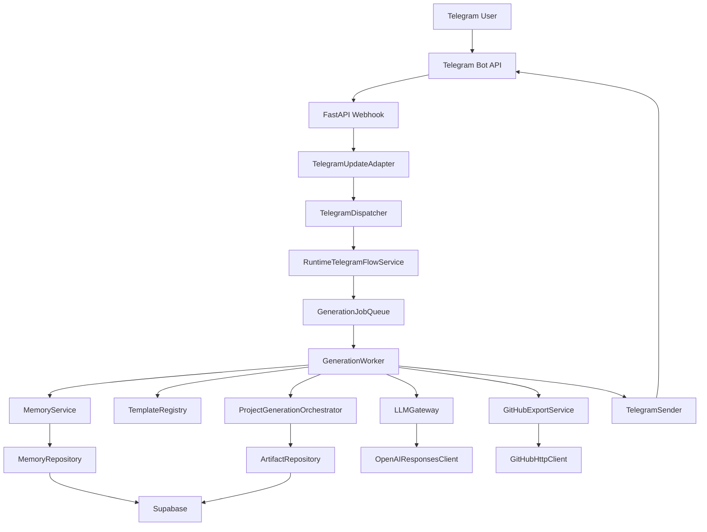

# Runtime Wiring MVP Implementation Plan

> **For agentic workers:** REQUIRED SUB-SKILL: Use superpowers:subagent-driven-development (recommended) or superpowers:executing-plans to implement this plan task-by-task. Steps use checkbox (`- [ ]`) syntax for tracking.

**Goal:** Wire the existing Vuls modules into a real FastAPI webhook runtime so a Telegram user can send `Create a CRM for a car wash` and receive a ZIP export or GitHub repository URL.

**Architecture:** FastAPI webhook is the production entrypoint. Startup loads `.env`, builds a runtime container, and routes Telegram updates through adapter -> dispatcher -> runtime service -> Supabase memory/projects/artifacts -> templates -> OpenAI -> generation -> ZIP/GitHub -> Telegram sender.

**Tech Stack:** Python 3.13, FastAPI, aiogram, Supabase Python client, OpenAI Python SDK, GitHub REST client, pytest, ruff, mypy.

---

## Pre-Implementation Answers

### 1. Plain-Text Project Detection

Plain text should not mean "always generate a project." Detection must be gated:

- Commands stay explicit: `/new ...`, `/projects`, `/status`, `/start`.
- In private chats, non-command text starts a new project only when there is no active project awaiting clarification or generation and the text passes `ProjectIntentDetector`.
- In group chats, non-command text starts a project only when the bot is mentioned or the message uses `/new`.
- The detector is deterministic for MVP:
  - positive verbs: `create`, `build`, `make`, `generate`, `develop`, `создай`, `сделай`;
  - product nouns: `crm`, `app`, `saas`, `dashboard`, `marketplace`, `agent`, `website`, `tool`, `bot`;
  - minimum meaningful length: at least 4 words;
  - negative/normal chat examples ignored: `hello`, `thanks`, `how are you`, `ok`, `what can you do`;
  - low-confidence messages get a safe clarification reply instead of generation.
- `Create a CRM for a car wash` passes because it contains a build verb, a product noun, and enough domain context.

### 2. Webhook Timeout Avoidance

Generation must not run inside the Telegram webhook request. The webhook should acknowledge quickly and the final result should be sent later through Bot API:

- Webhook validates secret and parses update.
- Runtime service persists the inbound event, project state, and queued generation job.
- Webhook immediately sends or schedules an acknowledgement such as `I started generating your project.`
- A background worker processes the generation job:
  - memory context;
  - template selection;
  - OpenAI manifest;
  - workspace build;
  - ZIP export;
  - optional GitHub export;
  - final Telegram message.
- MVP queue may be in-process with `asyncio.Queue`; the boundary must be a `GenerationJobQueue` protocol so Redis/Supabase queue can replace it later.
- If a job fails, the worker sends a user-safe localized failure message and persists the failure state.

---

## Architecture Changes

1. Replace hardcoded `test-secret` with `.env` loaded `TELEGRAM_WEBHOOK_SECRET`.
2. Make `create_api_app()` load settings and attach `RuntimeContainer` to `app.state`.
3. Start a background generation worker on FastAPI startup.
4. Convert Telegram webhook JSON into dispatcher-compatible objects.
5. Add project intent detection for private-chat plain text.
6. Add Telegram sender for messages, inline keyboards, and optional ZIP documents.
7. Add runtime service implementing Telegram business flow.
8. Replace `UnconfiguredProjectService` with runtime service dependency lookup.
9. Wire real Supabase repositories, OpenAI gateway, ZIP generation, and GitHub export.
10. Keep polling bot out of scope.

## New Files To Create

```text
src/vuls/runtime/__init__.py
src/vuls/runtime/container.py
src/vuls/runtime/jobs.py
src/vuls/runtime/telegram_service.py
src/vuls/runtime/project_service.py
src/vuls/runtime/project_records.py
src/vuls/bot/update_adapter.py
src/vuls/bot/sender.py
src/vuls/bot/intent.py
src/vuls/db/repositories/github.py
tests/unit/runtime/test_container.py
tests/unit/runtime/test_jobs.py
tests/unit/bot/test_update_adapter.py
tests/unit/bot/test_sender.py
tests/unit/bot/test_project_intent.py
tests/integration/test_runtime_webhook_zip_flow.py
tests/integration/test_runtime_webhook_github_flow.py
tests/integration/test_runtime_webhook_failure_flow.py
docs/operations/runtime-smoke-test.md
```

## Existing Files To Modify

```text
pyproject.toml
src/vuls/api/app.py
src/vuls/api/dependencies.py
src/vuls/api/routes/telegram.py
src/vuls/api/routes/internal.py
src/vuls/api/routes/health.py
src/vuls/bot/dispatcher.py
src/vuls/bot/messages.py
src/vuls/main.py
src/vuls/core/config.py
docs/operations/local-development.md
```

Dependency additions:

```text
openai
supabase
```

## Dependency Graph



## Startup Sequence

1. `vuls.main:create_app` calls `vuls.api.app:create_api_app`.
2. `create_api_app()` loads `Settings` from `.env`.
3. Validate required variables.
4. Build Supabase client.
5. Build repositories:
   - users;
   - projects;
   - memory;
   - artifacts;
   - GitHub metadata.
6. Build services:
   - `MemoryService`;
   - `TemplateRegistry`;
   - `OpenAIResponsesClient`;
   - `LLMGateway`;
   - `ProjectGenerationOrchestrator`;
   - `GitHubHttpClient`;
   - `GitHubExportService`;
   - `TelegramSender`;
   - `GenerationJobQueue`;
   - `RuntimeTelegramFlowService`;
   - `RuntimeProjectService`.
7. Store container in `app.state.runtime`.
8. Register routers.
9. On FastAPI startup, start generation worker.
10. On FastAPI shutdown, drain or stop generation worker safely.

## Milestones

### Milestone RW1: Runtime Settings And Container

**Goal:** Build real runtime dependencies from `.env`.

**Files:**

- Create: `src/vuls/runtime/__init__.py`
- Create: `src/vuls/runtime/container.py`
- Modify: `src/vuls/api/app.py`
- Modify: `src/vuls/main.py`
- Modify: `src/vuls/core/config.py`
- Modify: `pyproject.toml`
- Test: `tests/unit/runtime/test_container.py`

**Acceptance Criteria:**

- API app loads settings from `.env`.
- No hardcoded `test-secret` in production app creation.
- Container exposes settings, repositories, LLM gateway, GitHub export service, Telegram sender, and runtime services.
- `vuls` CLI starts the routed API app.
- Unit tests pass.

### Milestone RW2: Telegram Adapter, Intent Detection, And Sender

**Goal:** Convert webhook updates into dispatcher calls and send replies to Telegram.

**Files:**

- Create: `src/vuls/bot/update_adapter.py`
- Create: `src/vuls/bot/sender.py`
- Create: `src/vuls/bot/intent.py`
- Modify: `src/vuls/api/routes/telegram.py`
- Modify: `src/vuls/bot/dispatcher.py`
- Test: `tests/unit/bot/test_update_adapter.py`
- Test: `tests/unit/bot/test_sender.py`
- Test: `tests/unit/bot/test_project_intent.py`

**Acceptance Criteria:**

- Message update converts to dispatcher-compatible message.
- Callback update converts to dispatcher-compatible callback.
- Plain text `Create a CRM for a car wash` is classified as project intent in private chat.
- Normal chat text does not trigger generation.
- Group chat plain text requires mention or command.
- Sender maps `BotReply.keyboard` to Telegram inline keyboard.
- Sender can send text messages.

### Milestone RW3: Async Generation Jobs

**Goal:** Avoid Telegram webhook timeout by queueing generation.

**Files:**

- Create: `src/vuls/runtime/jobs.py`
- Modify: `src/vuls/api/app.py`
- Modify: `src/vuls/runtime/container.py`
- Test: `tests/unit/runtime/test_jobs.py`

**Acceptance Criteria:**

- Webhook returns quickly after enqueue.
- Worker processes queued jobs.
- Worker can send final Telegram message.
- Worker records failed jobs and sends safe failure replies.
- Queue boundary is replaceable.

### Milestone RW4: Runtime Telegram Flow Service

**Goal:** Wire Telegram business flow to memory, templates, OpenAI, generation, ZIP, and GitHub.

**Files:**

- Create: `src/vuls/runtime/telegram_service.py`
- Create: `src/vuls/runtime/project_records.py`
- Create: `src/vuls/db/repositories/github.py`
- Modify: `src/vuls/bot/messages.py`
- Test: `tests/integration/test_runtime_webhook_zip_flow.py`
- Test: `tests/integration/test_runtime_webhook_github_flow.py`
- Test: `tests/integration/test_runtime_webhook_failure_flow.py`

**Acceptance Criteria:**

- Plain text creates project and stores memory.
- CRM template selected for car wash CRM request.
- OpenAI gateway called through runtime service.
- ZIP artifact created and replied to Telegram.
- GitHub repository created and URL replied to Telegram.
- Provider failure returns safe Telegram message.

### Milestone RW5: Replace Internal Project Service

**Goal:** Remove unconfigured internal API service from runtime.

**Files:**

- Create: `src/vuls/runtime/project_service.py`
- Modify: `src/vuls/api/dependencies.py`
- Modify: `src/vuls/api/routes/internal.py`
- Test: `tests/unit/api/test_project_contracts.py`

**Acceptance Criteria:**

- Default runtime no longer returns `UnconfiguredProjectService`.
- Internal project routes use runtime service from `app.state.runtime`.
- Dependency overrides still work in tests.
- No production route raises `Project service is not configured`.

### Milestone RW6: Readiness And Manual Smoke Test

**Goal:** Add operational checks and manual runtime procedure.

**Files:**

- Modify: `src/vuls/api/routes/health.py`
- Create: `docs/operations/runtime-smoke-test.md`
- Modify: `docs/operations/local-development.md`

**Acceptance Criteria:**

- Health reports real dependency readiness or explicit not-ready reasons.
- Smoke test doc shows Telegram webhook setup.
- Smoke test doc shows sending `Create a CRM for a car wash`.
- Smoke test doc shows expected ZIP and GitHub outcomes.

## Risks

- In-process queue is acceptable for MVP but jobs are lost on process restart.
- Long generation may still be slow; final reply must be sent by worker, not webhook.
- GitHub client currently targets organization repo creation; user-owned repo support may need a small client branch.
- Telegram ZIP document sending depends on local file availability and file-size constraints.
- Supabase/OpenAI SDKs are not currently declared dependencies.
- Current health endpoint reports `supabase=ok` without checking a real connection.
- Duplicate Telegram updates require idempotency by `update_id`.
- Plain-text detection needs conservative defaults to avoid accidental project creation.

## Global Acceptance Criteria

- `python -m pytest` passes.
- `python -m ruff check .` passes.
- `python -m mypy src` passes.
- FastAPI loads runtime settings from `.env`.
- Webhook secret comes from `.env`.
- Real Telegram webhook update reaches dispatcher.
- Plain text starts project only when intent detection says it is a project request.
- `Create a CRM for a car wash` starts the MVP flow.
- Runtime writes memory/project/artifact records to Supabase.
- Runtime calls OpenAI through `LLMGateway`.
- Runtime creates project files and ZIP.
- Runtime can create GitHub repository and commit generated files.
- Telegram user receives final ZIP artifact/document or GitHub URL.
- Webhook does not block on long generation.
- No runtime route uses `UnconfiguredProjectService`.
- Manual smoke test passes with real Telegram, Supabase, OpenAI, and GitHub credentials.
