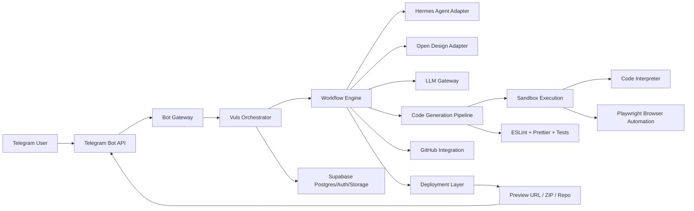
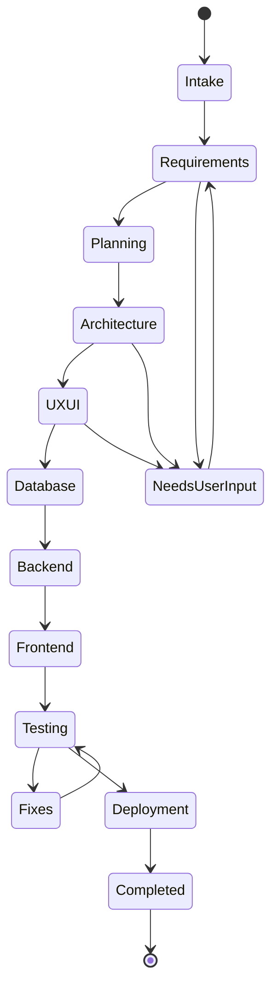
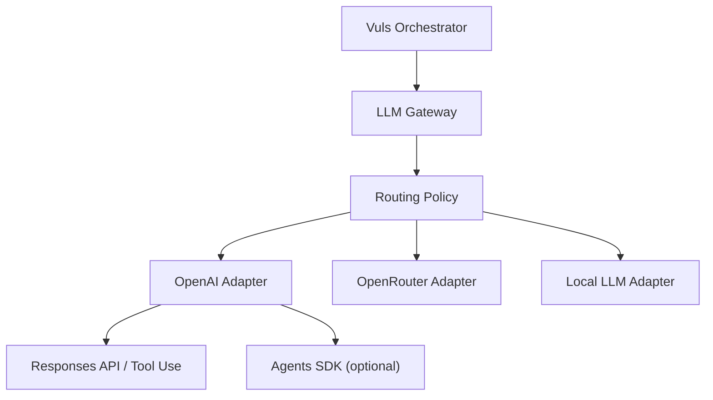

# Vuls Architecture and Product Specification

Дата: 2026-06-01
Статус: Draft for review
Владелец продукта: Vuls

## 1. Vision

Vuls - AI Product Builder, который принимает идею пользователя через Telegram и превращает ее в полноценный программный продукт через цепочку специализированных агентов. Цель продукта - дать пользователю опыт уровня Base44, Lovable, Bolt и Replit Agent, но с Telegram-first интерфейсом, модульной архитектурой и возможностью заменять ключевые компоненты без переписывания всей системы.

Главный принцип Vuls: одна большая пользовательская идея не запускает сразу множество несвязанных процессов. Система последовательно проходит этапы анализа, планирования, архитектуры, UX/UI, базы данных, backend, frontend, тестирования, исправления ошибок и деплоя. Каждый этап должен иметь входные данные, выходные артефакты, критерии завершения и проверку качества.

Vuls не должен быть просто "ботом, который генерирует код". Это продуктовый конвейер:

- Telegram принимает намерение пользователя.
- Orchestrator нормализует запрос и создает рабочую сессию.
- Hermes Agent планирует работу и контролирует этапы.
- Open Design генерирует UI/UX и дизайн-артефакты.
- OpenAI API или другой LLM слой генерирует, объясняет и исправляет код.
- Supabase хранит пользователей, проекты, артефакты, задачи и историю.
- GitHub хранит сгенерированные проекты пользователей.
- Sandbox и Code Interpreter безопасно запускают и проверяют код.
- Playwright проверяет веб-приложения в браузере.
- ESLint и Prettier обеспечивают базовое качество frontend-кода.
- Docker и Deployment Layer поднимают проекты в воспроизводимой среде.

## 2. Product Requirements

### 2.1 Primary User Journey

1. Пользователь пишет в Telegram: "Создай CRM для маленькой кофейни".
2. Vuls создает проектную сессию и уточняет только критически важные требования.
3. Hermes Agent формирует последовательный план этапов.
4. Vuls проектирует архитектуру и UX/UI до генерации кода.
5. Open Design создает UI/UX спецификацию и, при необходимости, визуальные артефакты.
6. LLM Layer генерирует код по утвержденной архитектуре.
7. Sandbox запускает код в изолированной среде.
8. Code Interpreter и тестовые воркеры проверяют код.
9. Playwright проверяет frontend-сценарии.
10. ESLint и Prettier приводят код к стандарту.
11. GitHub Integration сохраняет проект пользователя в репозиторий.
12. Deployment Layer подготавливает preview/deploy и возвращает ссылку или ZIP.

### 2.2 Functional Requirements

- Telegram Bot API должен быть основным пользовательским интерфейсом MVP.
- Supabase должен быть основной базой данных и источником состояния продукта.
- OpenAI API или другой LLM должен быть заменяемым "мозгом" системы.
- Hermes Agent должен отвечать за агентное планирование задач.
- Open Design должен отвечать за генерацию UI/UX и дизайн-решений.
- GitHub должен хранить проекты пользователей и историю версий.
- Docker должен обеспечивать воспроизводимый запуск пользовательских проектов.
- Sandbox должен изолировать выполнение недоверенного пользовательского кода.
- Code Interpreter должен запускать быстрые проверки, тесты и анализ ошибок.
- Playwright должен автоматически проверять веб-интерфейсы.
- ESLint и Prettier должны быть частью стандартного качества для JS/TS проектов.
- i18n должен быть встроен с первого дня.
- Все модули должны иметь адаптеры и быть заменяемыми.

### 2.3 Non-Functional Requirements

- Security-first: секреты, токены, пользовательский код и артефакты не должны смешиваться.
- Multi-tenant: пользовательские проекты и данные должны быть изолированы.
- Observability: каждая задача должна иметь trace, статус, логи и ошибку с контекстом.
- Idempotency: повтор webhook/update не должен создавать дубликаты критических операций.
- Resume-first: долгие задачи должны возобновляться после рестарта воркера.
- Cost awareness: LLM вызовы должны иметь лимиты, бюджет и журнал токенов.
- Replaceability: OpenAI можно заменить на Anthropic/OpenRouter/local LLM; GitHub - на GitLab; Supabase - на другой Postgres-совместимый слой.

## 3. Recommended Architecture Approach

### Approach A - Modular Monolith with Workers (Recommended)

Vuls стартует как единое backend-приложение с четкими внутренними модулями и отдельными воркерами для долгих задач. Внешние интеграции подключаются через адаптеры.

Плюсы:

- Быстрее создать MVP.
- Проще отлаживать пользовательский путь.
- Меньше инфраструктурной сложности.
- Модули можно позже вынести в сервисы.

Минусы:

- Нужна дисциплина границ модулей.
- При росте нагрузки потребуется вынос sandbox/agent/deploy в отдельные сервисы.

### Approach B - Microservices from Day One

Каждый слой сразу отдельный сервис: bot, orchestrator, agents, sandbox, design, deploy, storage.

Плюсы:

- Хорошо масштабируется.
- Четкая изоляция по runtime.
- Команды могут работать независимо.

Минусы:

- Слишком дорогой старт.
- Сложнее локальная разработка.
- Больше точек отказа до подтверждения product-market fit.

### Approach C - Agent-First CLI Platform

Telegram является тонкой оболочкой над локальными CLI-агентами и репозиториями.

Плюсы:

- Быстро проверить идею с Hermes/Open Design/Codex CLI.
- Хорошо подходит для локальных экспериментов.

Минусы:

- Сложнее сделать надежный SaaS.
- Труднее обеспечить multi-tenancy, sandboxing и биллинг.

Решение: начать с Approach A. Архитектура должна быть модульной, но без преждевременного разбиения на множество production-сервисов.

## 4. System Architecture



### 4.1 Core Modules

| Module | Responsibility | Replaceable By |
| --- | --- | --- |
| Bot Gateway | Telegram update intake, commands, message routing | Web UI, Slack, Discord |
| Orchestrator | Owns sessions, state machine, task lifecycle | Temporal, Durable Objects, custom workflow engine |
| Workflow Engine | Runs Vuls stages sequentially | BullMQ, Celery, Hatchet, Temporal |
| Hermes Adapter | Agent planning and task decomposition | LangGraph, OpenAI Agents SDK, custom planner |
| Open Design Adapter | UI/UX generation | Figma plugin, custom design agent, v0-like generator |
| LLM Gateway | Provider/model routing, prompts, budget | OpenAI, OpenRouter, Anthropic, local models |
| Project Builder | Creates file tree and code patches | Codex, custom code agent |
| Sandbox Runner | Executes untrusted code safely | Docker, Firecracker, Vercel Sandbox, E2B |
| Code Interpreter | Runs scripts, tests, small analysis jobs | Python runner, Node runner, container executor |
| QA Pipeline | Playwright, ESLint, Prettier, tests | Cypress, Biome, custom validators |
| GitHub Adapter | Repo creation, commits, branches, PRs | GitLab, Gitea, local Git |
| Deployment Adapter | Preview and production deploys | Vercel, Fly.io, Render, Docker host |
| Supabase Repository | Persistent state and storage | Neon/Postgres + S3 + Auth provider |

### 4.2 Stage State Machine

Every project must move through explicit states:



The state machine enforces the Vuls Core Rules:

- no UI before architecture;
- no code before plan;
- no deploy before testing;
- no multiple large tasks for the same project at the same time.

## 5. Agent Architecture

### 5.1 Agent Roles

| Agent | Purpose | Input | Output |
| --- | --- | --- | --- |
| Intake Agent | Normalizes Telegram text into structured brief | Telegram message | Project brief |
| Requirements Agent | Finds missing constraints | Brief, user context | Requirements checklist |
| Architect Agent | Designs modules, APIs, data flow | Requirements | Architecture spec |
| UX Agent | Produces UX flow and UI requirements | Architecture | UX/UI spec |
| DB Agent | Designs schema, RLS, migrations plan | Requirements, architecture | Database design |
| Backend Agent | Designs backend contracts and implementation plan | Architecture, DB design | Backend tasks |
| Frontend Agent | Designs frontend structure and i18n boundaries | UX/UI, API contracts | Frontend tasks |
| QA Agent | Runs tests and interprets failures | Project files, logs | Fix recommendations |
| Security Agent | Reviews secrets, sandboxing, permissions | System and project config | Security report |
| Deployment Agent | Prepares preview and deploy plan | Passing project | Deploy artifact |

### 5.2 Agent Execution Rule

Vuls must not run several major agents on the same unresolved stage in parallel. Parallelism is allowed only inside a stage when tasks are independent and bounded, for example:

- lint and formatting checks can run alongside unit tests;
- Playwright can run after the frontend server is ready;
- artifact upload can run after tests have passed.

Hermes coordinates the plan, but the Orchestrator owns the authoritative workflow state. This prevents an external agent from skipping required stages.

### 5.3 Agent Contract

Each agent call uses a structured contract:

```json
{
  "project_id": "uuid",
  "stage": "architecture",
  "input_artifacts": ["requirements.md"],
  "constraints": {
    "languages": ["ru", "en", "es", "de", "fr", "pt", "it", "tr", "ar", "zh", "ja", "ko"],
    "no_hardcoded_ui_text": true,
    "sandbox_required": true
  },
  "expected_outputs": ["architecture.md", "risk_report.md"],
  "budget": {
    "max_llm_calls": 8,
    "max_runtime_seconds": 900
  }
}
```

## 6. Telegram Bot API

Telegram is the primary interface for MVP. The Bot Gateway must support:

- `/start` - onboarding and language selection;
- `/new` - create a new product request;
- `/status` - show current project status;
- `/projects` - list user projects;
- `/approve` - approve a stage;
- `/cancel` - cancel current job;
- file upload - optional requirement documents, screenshots, archives;
- voice input - later roadmap item.

### 6.1 Webhook vs Polling

MVP local development may use long polling. Production should use webhook over HTTPS with idempotent update handling.

Webhook handler requirements:

- verify secret token/path;
- reject unknown methods;
- persist raw update before processing;
- deduplicate by Telegram `update_id`;
- enqueue work and respond quickly;
- never run long LLM work inside webhook request.

### 6.2 Telegram Rate Safety

The message sender must include:

- per-chat rate limit;
- global rate limit;
- retry handling for 429;
- message chunking for long responses;
- file/document fallback for large artifacts.

## 7. Supabase Database

Supabase is the default database layer for Vuls. It provides Postgres, Auth, Storage, Realtime where needed, and a strong foundation for RLS-based multi-tenancy.

### 7.1 Data Model

Initial tables:

| Table | Purpose |
| --- | --- |
| `profiles` | Application user profile mapped to Telegram identity |
| `telegram_accounts` | Telegram user/chat metadata and consent state |
| `projects` | User-created product projects |
| `project_members` | Access control for projects |
| `project_stages` | Workflow stage status and approvals |
| `agent_runs` | Agent calls, prompts metadata, status, cost |
| `tasks` | Fine-grained work items within a stage |
| `artifacts` | Generated files, docs, logs, screenshots |
| `repositories` | GitHub repo mapping |
| `deployments` | Preview/production deployment records |
| `sandbox_runs` | Code execution attempts and results |
| `test_runs` | Playwright/unit/lint/format results |
| `i18n_messages` | Product UI copy keys and translations |
| `audit_events` | Security and lifecycle audit log |

### 7.2 RLS and Access Control

RLS must be enabled on all tables exposed through Supabase Data API. Policies should be project-scoped through `project_members`, not through user-editable metadata.

Rules:

- never expose service role keys to clients;
- use server-side service role only inside trusted backend;
- authorization decisions must use server-controlled user/project membership;
- generated user projects must not share credentials;
- storage buckets must separate system artifacts and user deliverables.

### 7.3 Storage

Supabase Storage can hold:

- uploaded requirement files;
- generated specs;
- screenshots from Playwright;
- build logs;
- ZIP exports;
- prompt/run artifacts that are safe to retain.

Large code repositories should live in GitHub, not only in Supabase Storage.

## 8. OpenAI / LLM Layer

The LLM Layer is the model gateway. It must abstract provider-specific APIs behind a stable internal interface.

### 8.1 Responsibilities

- model selection by task type;
- prompt template rendering;
- structured output validation;
- tool/function call mediation;
- token/cost tracking;
- retries with backoff;
- provider fallback;
- safety filtering;
- prompt and response logging with sensitive data redaction.

### 8.2 Provider Abstraction



Recommended default:

- OpenAI for high-quality planning, code generation and tool-using workflows.
- Provider fallback through OpenRouter or another compatible layer.
- Local models only for non-sensitive low-cost background jobs until quality is proven.

### 8.3 Output Contracts

The LLM must not return arbitrary prose when the next system step needs structure. Critical stages should use schemas:

- requirements checklist;
- architecture decisions;
- file tree;
- code patch plan;
- test results;
- fix report.

## 9. Hermes Agent Integration

Hermes Agent is the planning and stage-control collaborator, not the sole authority. The Orchestrator owns state; Hermes proposes plans and next actions.

### 9.1 Integration Modes

MVP can support one mode first:

| Mode | Description | Fit |
| --- | --- | --- |
| CLI Adapter | Orchestrator invokes Hermes as a subprocess in a controlled workspace | Local/MVP |
| HTTP Adapter | Hermes runs as a service behind an internal API | Production |
| Native Gateway | Hermes handles Telegram directly | Useful for experiments, less control for Vuls |

Recommended: CLI Adapter for local MVP, then HTTP Adapter for production.

### 9.2 Hermes Responsibilities

- turn user idea into ordered stage plan;
- detect missing requirements;
- suggest subtask boundaries;
- produce self-check after every stage;
- recommend when to ask user for approval;
- never bypass Orchestrator stage locks.

## 10. Open Design Integration

Open Design is the UI/UX generation layer. Vuls should treat it as a replaceable design engine.

### 10.1 Responsibilities

- transform product requirements into UX flows;
- generate layout specs;
- produce component hierarchy;
- suggest design tokens;
- create responsive behavior notes;
- produce frontend-ready UI requirements;
- optionally export design assets.

### 10.2 Contract

Open Design input:

- product brief;
- target platforms;
- required languages;
- accessibility constraints;
- brand/tone if provided;
- architecture constraints.

Open Design output:

- UX flow;
- screen inventory;
- component map;
- layout behavior;
- design tokens;
- empty/loading/error states;
- i18n text key list, not hardcoded text.

## 11. GitHub Integration

GitHub stores generated user projects, version history and collaboration artifacts.

### 11.1 Responsibilities

- create repository per project or per user workspace;
- commit generated files;
- create branches for major iterations;
- create pull requests for changes;
- store CI results and deployment metadata;
- allow user export/ownership transfer later.

### 11.2 Repository Strategy

Recommended MVP strategy:

- one private repository per generated project;
- branch naming: `vuls/<stage-or-feature>`;
- commits generated by Vuls must include project id and stage id;
- never commit secrets;
- generated `.env.example` only includes variable names.

### 11.3 GitHub App vs PAT

Production should use a GitHub App with scoped permissions. Personal access tokens are acceptable only for internal prototypes.

## 12. Docker Infrastructure

Docker provides reproducible runtime for Vuls services and generated projects.

### 12.1 Vuls Service Containers

Initial containers:

- `bot-gateway`;
- `orchestrator`;
- `worker`;
- `sandbox-runner`;
- `playwright-runner`;
- `redis` or queue backend, if used;
- optional local Postgres for development;
- optional Open Design/Hermes sidecars.

### 12.2 Generated Project Containers

Each generated project should include:

- `Dockerfile`;
- `docker-compose.yml` when needed;
- `.env.example`;
- health check;
- start/build/test scripts;
- resource expectations.

## 13. Sandbox Execution Environment

Sandboxing is mandatory because Vuls executes user-requested and model-generated code.

### 13.1 Isolation Requirements

- no host filesystem access outside assigned workspace;
- no access to Vuls secrets;
- strict CPU/memory/time limits;
- network disabled by default, allowlisted only when required;
- read-only base images where possible;
- disposable workspace per run;
- logs captured and attached to `sandbox_runs`.

### 13.2 Sandbox Options

| Option | Use Case | Trade-off |
| --- | --- | --- |
| Docker with hardened settings | MVP and controlled environments | Requires careful host hardening |
| Firecracker microVMs | Strong isolation | More complex operations |
| Managed sandbox provider | Faster production readiness | Vendor cost and dependency |

Recommended: hardened Docker for local MVP, design interface so Firecracker/managed sandbox can replace it.

## 14. Code Interpreter

Code Interpreter is the fast execution and analysis layer. It should run bounded commands and summarize results for agents.

Use cases:

- run unit tests;
- run type checks;
- run syntax checks;
- inspect generated files;
- execute small scripts;
- parse build output;
- produce structured failure summaries.

Rules:

- all execution must happen inside sandbox;
- command allowlist per project type;
- maximum output size;
- maximum runtime;
- no interactive commands;
- no direct secret access.

## 15. Playwright Browser Automation

Playwright validates generated web apps through browser-level testing.

### 15.1 Responsibilities

- start generated app preview in sandbox;
- run smoke test: page loads, no console errors, main flow visible;
- run user-story tests generated from requirements;
- capture screenshots;
- report accessibility and layout issues where possible;
- attach trace and screenshots to artifacts.

### 15.2 MVP Browser Checks

- homepage renders;
- primary CTA/input works;
- navigation works;
- mobile viewport renders without overflow;
- no fatal console errors;
- generated app has loading/error/empty states where required.

## 16. ESLint

ESLint enforces baseline JavaScript/TypeScript correctness.

Requirements:

- include project-specific ESLint config for JS/TS projects;
- run after code generation and before Playwright;
- treat syntax errors and unsafe globals as blocking;
- return structured results to QA Agent;
- avoid excessive style-only rules that slow down iteration.

ESLint is a validator, not the only quality system. TypeScript, tests and runtime checks remain necessary.

## 17. Prettier

Prettier provides deterministic formatting for generated code.

Requirements:

- include Prettier config in generated JS/TS/frontend projects;
- run before final commit;
- keep formatting separate from semantic fixes;
- avoid reformatting unrelated files during iterative updates;
- integrate with lint-staged or CI later.

## 18. Security Layer

### 18.1 Secrets

- Telegram token, OpenAI keys, Supabase service role, GitHub credentials and deployment tokens must live in server-side secret storage.
- No secrets in generated repositories.
- `.env.example` is allowed; `.env` is not committed.
- Secrets used by user deployments must be scoped per project.

### 18.2 User and Project Isolation

- every project has an owner and membership list;
- every artifact belongs to a project;
- every sandbox run belongs to a project and stage;
- users cannot access artifacts outside projects they belong to;
- audit events record sensitive actions.

### 18.3 Prompt and Artifact Safety

- redact tokens and personally sensitive fields from logs;
- store prompt history with access control;
- block requests that ask for credential theft, malware or unsafe deployment behavior;
- scan generated code for suspicious commands before execution;
- require explicit approval for network access inside sandbox.

## 19. Multi-language System (i18n)

Vuls must support multilingual UI and generated product copy from day one.

Required languages:

- Russian (`ru`)
- English (`en`)
- Spanish (`es`)
- German (`de`)
- French (`fr`)
- Portuguese (`pt`)
- Italian (`it`)
- Turkish (`tr`)
- Arabic (`ar`)
- Chinese (`zh`)
- Japanese (`ja`)
- Korean (`ko`)

Rules:

- no hardcoded UI text in frontend components;
- all interface strings use translation keys;
- generated apps include i18n scaffolding when they have UI;
- default user language is detected from Telegram when available;
- users can override language;
- RTL support is required for Arabic;
- translation completeness is checked before deploy.

Suggested key structure:

```json
{
  "app.start.title": "Create products from ideas",
  "project.status.planning": "Planning",
  "errors.generic": "Something went wrong"
}
```

## 20. Deployment Architecture

### 20.1 Vuls Platform Deployment

MVP:

- Docker Compose for local development;
- one backend app plus worker;
- Supabase hosted or local development stack;
- GitHub App in development mode;
- webhook endpoint exposed via HTTPS tunnel or staging domain.

Production:

- containerized services;
- managed Postgres/Supabase;
- queue-backed workers;
- separate sandbox runner pool;
- separate Playwright runner pool;
- object storage for artifacts;
- observability stack;
- CI/CD deployment pipeline.

### 20.2 Generated Project Deployment

Generated projects can support multiple deployment targets through adapters:

- Vercel for frontend/Next.js projects;
- Docker host for backend/full-stack projects;
- GitHub Pages for static sites;
- manual ZIP export for early MVP.

Deployment must happen only after tests pass.

## 21. Scaling Strategy

### 21.1 Scale by Workload Type

| Workload | Scaling Method |
| --- | --- |
| Telegram webhook | stateless replicas with idempotent queue writes |
| Orchestrator | few replicas, DB-backed locks |
| Agent work | queue workers by stage type |
| Sandbox execution | isolated runner pool with strict limits |
| Playwright | browser runner pool, capped concurrency |
| LLM calls | provider rate limits, budget queues |
| GitHub/deploy | serialized per project |

### 21.2 Concurrency Rules

- one active major stage per project;
- multiple projects can run concurrently;
- per-user quota prevents accidental spend spikes;
- per-provider rate limits are centrally enforced;
- every long job can be resumed or marked failed with retry context.

### 21.3 Data Scaling

- Supabase/Postgres starts as primary store;
- partition large logs/artifacts into object storage;
- archive old agent traces;
- add read replicas only after real bottlenecks appear;
- avoid storing full repo content in database.

## 22. Roadmap

### Phase 0 - Architecture and Product Definition

- Write and approve this specification.
- Define MVP boundaries.
- Select initial stack.
- Define security and sandbox rules.

### Phase 1 - Telegram MVP

- Telegram bot intake.
- Supabase schema.
- project/session state machine.
- basic LLM planning and response.
- GitHub repo creation.
- simple ZIP/repo output.

### Phase 2 - Agentic Product Builder

- Hermes planning integration.
- stage approvals.
- architecture and UX document generation.
- code generation pipeline.
- ESLint/Prettier/test loop.

### Phase 3 - Safe Execution and Browser QA

- Docker sandbox runner.
- Code Interpreter.
- Playwright smoke tests.
- screenshot artifacts.
- failure analysis and auto-fix loop.

### Phase 4 - UI/UX Generation

- Open Design adapter.
- design token generation.
- i18n-aware UI generation.
- mobile-first quality checks.

### Phase 5 - Deployment and Collaboration

- preview deployments;
- GitHub PR workflow;
- user project dashboard;
- team members;
- audit logs;
- billing/quotas if needed.

### Phase 6 - Platform Scale

- separate runner pools;
- stronger sandbox isolation;
- multiple LLM providers;
- project templates;
- enterprise controls.

## 23. Critical Architecture Analysis

### 23.1 Weak Spot: Too Many Powerful External Components

Risk: Hermes, Open Design, OpenAI, GitHub, Supabase, Docker and Playwright all introduce independent failure modes.

Improvement:

- define adapters for every external component;
- store all stage outputs as artifacts;
- allow degraded mode, for example "LLM planning without Open Design";
- add health checks per adapter.

### 23.2 Weak Spot: Sandbox Security

Risk: generated code can be malicious or accidentally destructive.

Improvement:

- run all code in disposable isolated containers;
- deny network by default;
- add static command scanning before execution;
- never mount host secrets;
- keep sandbox runner physically/logically separate from orchestrator.

### 23.3 Weak Spot: Agent Drift

Risk: agents may skip required stages, produce unstructured output or contradict prior decisions.

Improvement:

- Orchestrator owns the state machine;
- every agent output must validate against schema;
- every stage has explicit acceptance criteria;
- user approval gates high-impact transitions.

### 23.4 Weak Spot: Telegram UX for Complex Product Building

Risk: Telegram is convenient for input but weak for reviewing complex UI/code artifacts.

Improvement:

- use Telegram for commands and approvals;
- send links to preview, GitHub repo, screenshots and spec documents;
- add web dashboard after MVP;
- summarize long outputs, attach full artifacts as files.

### 23.5 Weak Spot: i18n Complexity

Risk: 12 languages from day one can slow product generation and produce incomplete translations.

Improvement:

- enforce key-based i18n scaffolding from the start;
- require only core system copy to be human-reviewed early;
- allow generated app translations to be marked machine-generated;
- add translation completeness checks before deploy.

### 23.6 Weak Spot: Cost and Rate Limits

Risk: LLM and browser automation can become expensive under repeated retries.

Improvement:

- set per-user and per-project budgets;
- cache stage outputs;
- summarize logs before sending them to LLM;
- cap auto-fix loops;
- require user confirmation after repeated failures.

### 23.7 Weak Spot: GitHub Ownership Model

Risk: projects stored under a platform-owned GitHub org may later need transfer to users.

Improvement:

- store repo ownership metadata;
- support export from day one;
- use GitHub App permissions;
- do not couple project identity to repository URL.

## 24. Open Decisions

These decisions should be confirmed before implementation:

1. Product name: latest request uses "Vuls"; repository folder is "Vols". Choose one canonical public name before UI work.
2. Initial backend language: TypeScript/Node.js or Python/FastAPI.
3. Workflow engine: simple DB-backed queue for MVP or a formal engine like Temporal.
4. Sandbox provider: hardened Docker first or managed sandbox first.
5. Deployment target for generated apps: Vercel first, Docker first, or ZIP/GitHub first.
6. GitHub model: platform-owned GitHub App or user-connected GitHub account.

## 25. Acceptance Criteria for This Specification

The architecture document is complete when:

- all required sections from the user request are present;
- the system is modular and every external dependency has an adapter boundary;
- the Vuls stage workflow is enforced;
- Supabase, LLM, Telegram, Hermes, Open Design, GitHub, Docker, Sandbox, Code Interpreter, Playwright, ESLint and Prettier are included;
- i18n requirements cover all required languages;
- deployment and scaling strategies are defined;
- critical weaknesses and improvements are documented;
- implementation has not started.

## 26. Reference Links

- Telegram Bot API: https://core.telegram.org/bots/api
- Supabase Row Level Security: https://supabase.com/docs/guides/database/postgres/row-level-security
- Supabase API security guidance: https://supabase.com/docs/guides/api/securing-your-api
- OpenAI platform docs: https://platform.openai.com/docs
- OpenAI Agents SDK guide: https://openai.github.io/openai-agents-python/
- GitHub REST repositories docs: https://docs.github.com/en/rest/repos/repos
- Docker Compose docs: https://docs.docker.com/compose/
- Playwright docs: https://playwright.dev/docs/intro
- ESLint configuration docs: https://eslint.org/docs/latest/use/configure/
- Prettier configuration docs: https://prettier.io/docs/configuration

